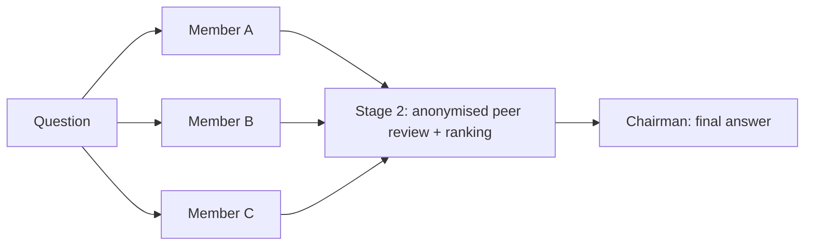

## User Input

```text
$ARGUMENTS
```

`$ARGUMENTS` is the question to put to the council. If it is empty, ask the user for
the question before doing anything else.

## What this skill does

Port of the [llm-council](https://github.com/karpathy/llm-council) idea to Copilot CLI.
Instead of calling OpenRouter, each council member is a `task` sub-agent pinned to a
different model via the `model` parameter.



## Council configuration

Default council (edit this list to taste — pick genuinely different vendors, that is the
whole point):

| Seat | Model id |
| --- | --- |
| Member A | `claude-opus-4.8` |
| Member B | `gpt-5.6-sol` |
| Member C | `gemini-3.8-flash` |
| Member D | `grok-4.6` |
| **Chairman** (does not answer or vote — synthesises only) | `claude-opus-5` |

Full council = **4 members + 1 Chairman = 5 models**.

Rules for adapting the council:

- Only use model ids that the `task` tool actually lists as available. If one is missing,
  substitute the nearest sibling from the same vendor and say so in the final report.
- Cheap/simple questions: 2–3 members. Hard, high-stakes, or design questions: 4 members.
- Never put the same vendor in two seats unless the user asks for it.
- The Chairman must not be one of the members if you can avoid it.

## Procedure

### Stage 0a — Announce the council (mandatory)

Before any other tool call, emit this banner verbatim as plain chat text so the user always
knows a council is running and never mistakes it for an ordinary answer:

```text
🏛️ **LLM Council convened** — <N> members (<model-a>, <model-b>, …) + Chairman <chairman> = <N+1> models
```

Then, immediately before Stage 4, close with:

```text
🏛️ **Council adjourned** — <N>/<N> members reported · synthesis by <chairman>
```

Both banners are required even when the user asked for speed or you skipped Stage 2. If a
member failed, say `3/4 members reported` and name the absentee. Never run the council
silently.

### Stage 0 — Frame the question

Restate the question in one self-contained paragraph. Council members are stateless and
share none of your conversation, so bake in everything they need: the actual question,
relevant repo/file context you have already read (paste the snippets, do not just name the
files), constraints, and the desired output shape. This framing text is reused verbatim in
every member prompt, so write it once and reuse it.

If the question is about code in the current workspace, read the relevant files **first**
and inline them into the framing. Do not make members re-explore the repo — it wastes time
and they may each read different things.

### Stage 1 — First opinions (parallel)

Launch every member in a **single response** so they run in parallel. Use:

- `agent_type: "general-purpose"` for questions needing reasoning, design or judgement.
- `agent_type: "explore"` only if the seat's job is purely to gather facts from the repo.
- `mode: "background"` when there are 3+ members, `sync` for 2. If background, launch all
  of them and then wait — do not poll one at a time.
- `model: <seat model id>`, `reasoning_effort: "high"` for hard questions.
- `name`: `council-a`, `council-b`, … so results are easy to attribute.

Member prompt template:

```text
You are one member of an LLM council answering an important question independently.
Other models are answering the same question separately; you will not see them.

<question>
{framing from Stage 0}
</question>

Answer it directly and completely. Show your reasoning where it matters, state your
assumptions explicitly, and flag anything you are genuinely uncertain about instead of
guessing confidently. Do not ask clarifying questions — make your assumptions explicit and
answer anyway. Aim for {N} words.
```

Collect each answer verbatim. Do not summarise yet.

### Stage 2 — Anonymised peer review

Relabel the Stage 1 answers as **Response 1, Response 2, …** in a *shuffled* order and
strip every hint of which model wrote which (model names, signature phrasing, "as an AI
built by …"). Keep your own private mapping from label back to model.

Then launch one reviewer per member, again in parallel, each pinned to that member's model:

```text
You are judging anonymous answers to the question below. You do not know which model wrote
which, and one of them may be your own — judge purely on merit.

<question>
{framing from Stage 0}
</question>

<responses>
Response 1: ...
Response 2: ...
Response 3: ...
</responses>

For each response, give: (a) one sentence on its strongest contribution, (b) any factual
error, unsupported claim, or missing consideration you can identify. Then rank all
responses from best to worst on accuracy first and insight second, and justify the top
choice in two sentences. End with a line exactly of the form:
RANKING: <label>, <label>, <label>
```

Aggregate the rankings (Borda count or simple average position) to get a council ordering.
Note explicitly where reviewers disagree — disagreement is signal, and it belongs in the
final report.

Skip Stage 2 only if the user asked for speed, or if the Stage 1 answers already agree on
every substantive point. Say so when you skip it.

### Stage 3 — Chairman synthesis

Run one final `task` sub-agent, `agent_type: "general-purpose"`, `mode: "sync"`, pinned to
the Chairman model, with all Stage 1 answers (still anonymised) plus the Stage 2 reviews
and the aggregate ranking:

```text
You are the Chairman of an LLM council. Below are independent answers to a question and the
council's anonymous peer reviews and ranking. Produce the single best final answer.

<question>...</question>
<responses>...</responses>
<reviews>...</reviews>
<ranking>...</ranking>

Do not merely average the responses and do not describe the deliberation. Take the correct
and well-supported material, discard what the reviewers showed to be wrong, and resolve
contradictions on the merits rather than by majority vote. Where the council genuinely
disagrees and the evidence does not settle it, say so explicitly and give your own call.
Output only the final answer to the user's question.
```

### Stage 4 — Report

Present to the user, in this order:

1. **Final answer** — the Chairman's output, front and centre. This is the deliverable.
2. **Council ranking** — a short table de-anonymising the labels: model, aggregate rank.
3. **Where the council disagreed** — 1–3 bullets, only if there was real disagreement.
4. Offer to show any individual member's full answer on request. Keep them in context, do
   not dump thousands of words into the chat and do not write them to disk.

The 100-word brevity rule does **not** apply to the Chairman's final answer — that is the
product the user asked for. It does apply to your own framing around it.

## Guardrails

- **Do not convene a council for trivial questions.** If you can answer confidently
  yourself, say so and offer the council rather than burning four models on it.
- **Never let members edit files.** The council deliberates; only you act on the outcome.
  If the answer implies code changes, present the plan and let the user approve.
- Councils are slow and expensive. The Stage 0a banner is the only check-in — after it,
  run the whole thing to completion without asking the user anything.
- Do not write council transcripts or logs to disk. Keep member answers in context and
  offer them on request; the on-screen banners are the audit trail.
- If a member fails or times out, continue with the remaining members and note the absence
  in the report. Do not restart the whole council.
- Preserve the anonymisation. Leaking model identity into Stage 2 defeats the mechanism.
